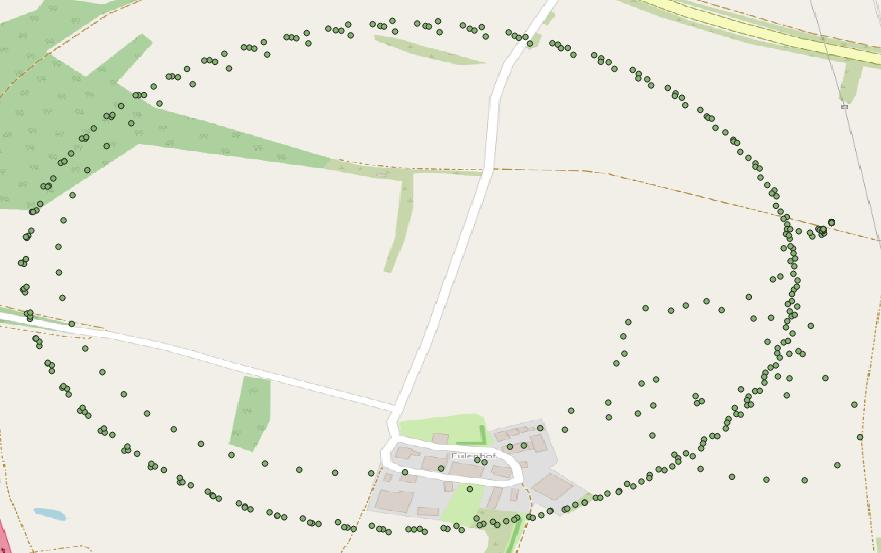
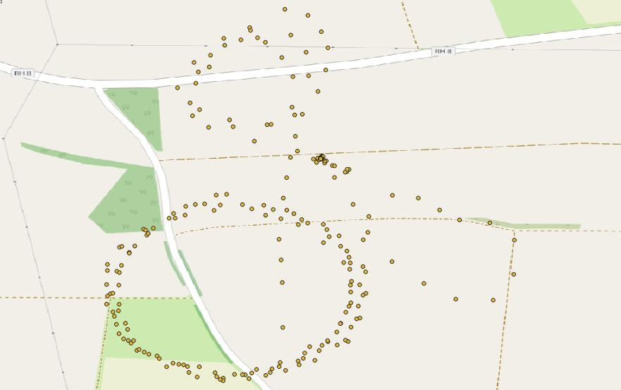
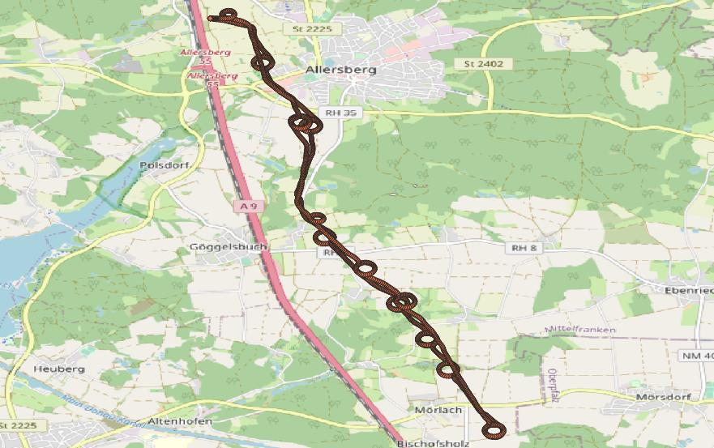

# 5G Connectivity Data for Autonomuous Drones – 5G Mobilfunk-Konnektivitätsdaten für autonome Drohnen

Das Repository enthält Daten zur Mobilfunk-Konnektivität einer autonomen Drohne in einem experimentellen 5G-Mobilfunknetz. Die Daten umfassen drei Szenarien:

1. Maximaler Ende-zu-Ende Durchsatz
2. Network Slicing
3. Langstreckenflug

Die Daten wurden im Projekt [FreeRail](https://www.bmvi.de/SharedDocs/DE/Artikel/DG/mfund-projekte/free-rail.html) mit einer [Quantum System Trinity F90](https://www.quantum-systems.com/project/trinity-f90) im Testfelds des [5G ConnectedMobility](http://www.5g-connectedmobility.com) Projekts erfasst und auf der [mCloud](https://www.mcloud.de/en/web/guest/suche/-/results/detail/61CC8AD7-64FC-46B0-8816-825F73DD30C5) bereitgestellt.

Mit den Daten ist es möglich, die Konnektivität der Drohne für verschiedene Flughöhen, Konfigurationen des Mobilfunknetzes mit Network Slices sowie Kurz- und Langstreckengflüge abzuschätzen.

Die Daten liegen im GeoJson- und CSV-Format vor.

## 1. Maximaler Ende-zu-Ende Durchsatz

Generierung der Testdaten: [iPerf](https://iperf.fr) TCP

Die Messwerte enthalten:

* GPS_Lat [°]
* GPS_Lon[°]
* RSRP [dBm]
* Flughöhe [m]
* Durchsatz TCP Stream [Mbps]

Gemessene 2D-Positionen für Szenario 1:

## 2. Network slicing

Network Slices: Slice A - Video und Slice B - Command & Control (C2)

Generierung der Testdaten: [iPerf](https://iperf.fr) UDP (Video und C2)

Die Messwerte enthalten:

* Sequenznummer []
* Zeitstempel (Unix Time) [s]
* GPS_Lat [°]
* GPS_Lon[°]
* Geschwindigkeit [m/s]
* GPS_Alt [m]
* RSRP [dBm]
* RSSI [dBm]
* SINR [dB]
* Durchsatz Slice A [Mbps]
* Durchsatz Slice B [Mbps]

Gemessene 2D-Positionen für Szenario 2:

## 3. Langstreckenflug

Generierung der Testdaten: [iPerf](https://iperf.fr) UDP (HD Video und C2)

Fluglänge: Etwa 7 km (Long-distance Vision-Line-of-Sight, VLOS)

Die Messwerte enthalten:

* Zeitstempel (Unix Time) [s]
* RSSI [dBm]
* RSRP [dBm]
* RSRQ []
* SNR [dB]
* GPS_Lat [°]
* GPS_Lon[°]
* GPS_Alt [m]
* Flughöhe [m]
* Durchsatz [Mbps]

Gemessene 2D-Positionen für Szenario 3:

